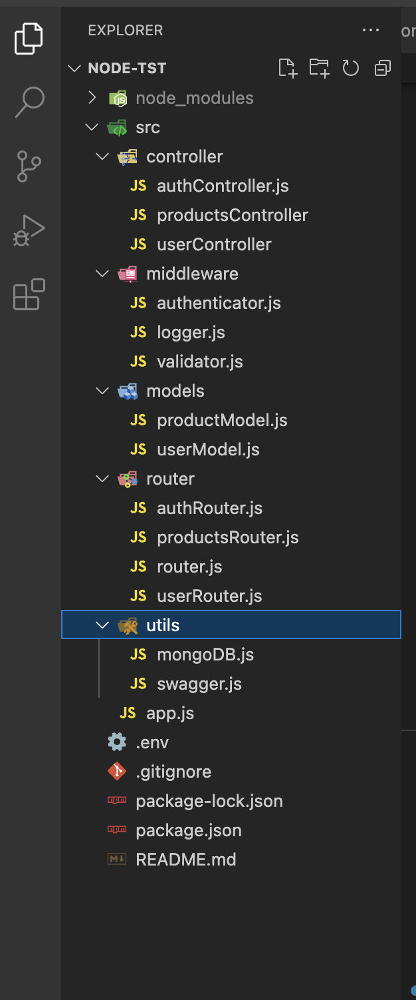

# node-tst
Node test api server 

# Project folder Structure

# TechStack
Node-tst project is built on Node.js by using following 

Node v20.6.1 : 
[Node v20.6.1 :](https://nodejs.dev/en/about/)

As an asynchronous event-driven JavaScript runtime, Node.js is designed to build scalable network applications. In the following "hello world" example, many connections can be handled concurrently. Upon each connection, the callback is fired, but if there is no work to be done, Node.js will sleep. 

[express :](https://www.npmjs.com/package/express?activeTab=readme)

Express is a popular web application framework for Node.js. It simplifies the process of building web applications and APIs by providing a set of robust and flexible features. Express.js is designed to be minimal and unopinionated, allowing developers to structure their applications as they see fit while providing essential tools for routing, middleware, and request/response handling.
Here are some key features and concepts associated with Express.js:

`Middleware:` Express uses a middleware system that allows you to define functions that can process incoming HTTP requests and responses. Middleware functions can perform tasks like authentication, logging, data parsing, and more. You can use built-in middleware or create custom middleware to suit your application's needs.

`Routing:` Express provides a routing mechanism that allows you to define routes for handling different HTTP methods (GET, POST, PUT, DELETE, etc.) and URL patterns. Route handlers are functions that execute when a specific route is matched, making it easy to create RESTful APIs and web applications.

`HTTP Utility Methods:` Express simplifies working with HTTP requests and responses by providing utility methods and properties to access request headers, query parameters, request bodies, and more. It also facilitates sending responses with various status codes and content types.

`Views and Templates:` While Express is primarily known for building APIs, it can also serve as a framework for building web applications with views and templates. It supports various view engines like EJS, Pug (formerly Jade), and Handlebars for rendering dynamic HTML pages.

`Static File Serving:` Express can serve static files (e.g., HTML, CSS, JavaScript, images) using the built-in express.static middleware. This simplifies the process of serving client-side assets.

`Middleware Ecosystem:` Express has a rich ecosystem of third-party middleware packages available via npm. You can easily extend Express's functionality by adding middleware for tasks like authentication, sessions, and caching.

`Community and Popularity:` Express has a large and active community of developers, making it one of the most widely used Node.js web frameworks. As a result, you can find a wealth of resources, tutorials, and plugins to support your development.

[MongoDB :](https://www.mongodb.com/)

MongoDB is a popular and widely used NoSQL (Not Only SQL) database management system. It is designed to store, retrieve, and manage data in a flexible, schema-less format, making it well-suited for various types of applications and use cases. MongoDB is known for its scalability, flexibility, and ease of use, and it has gained significant popularity among developers and organizations.